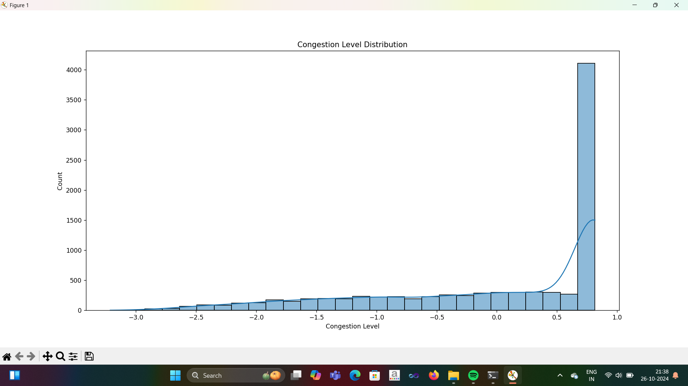
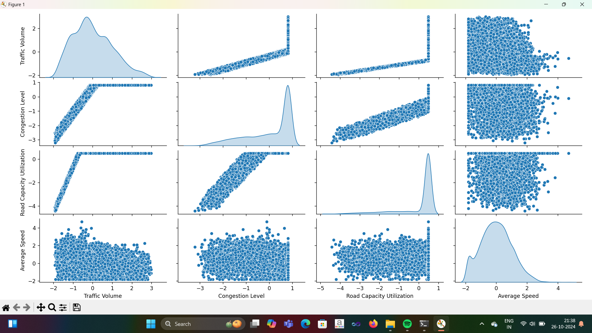
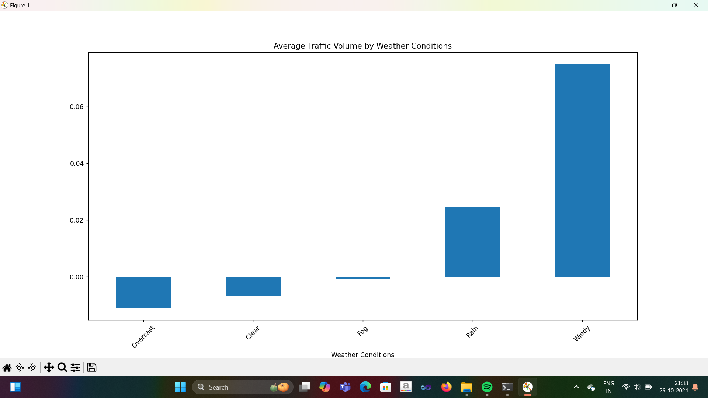
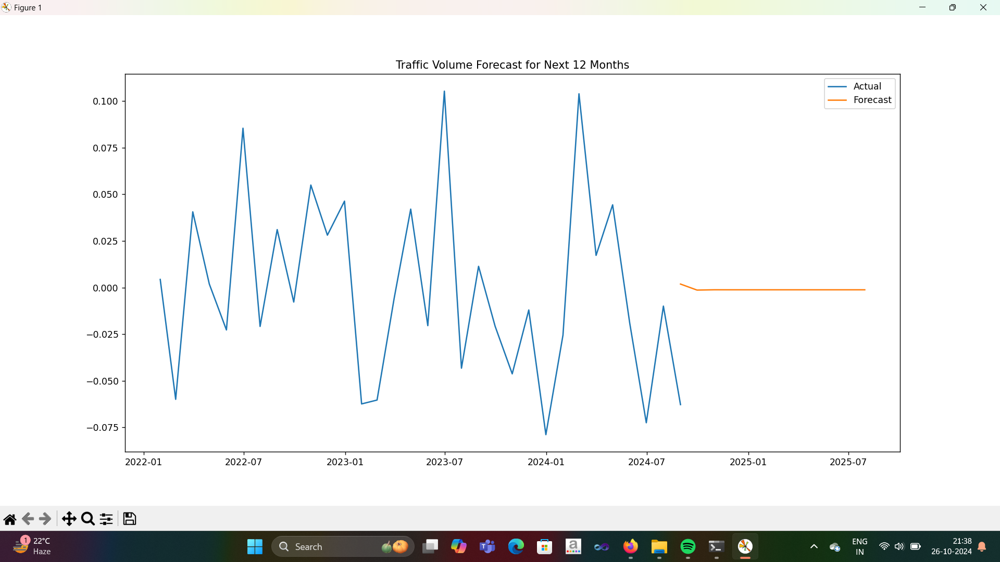
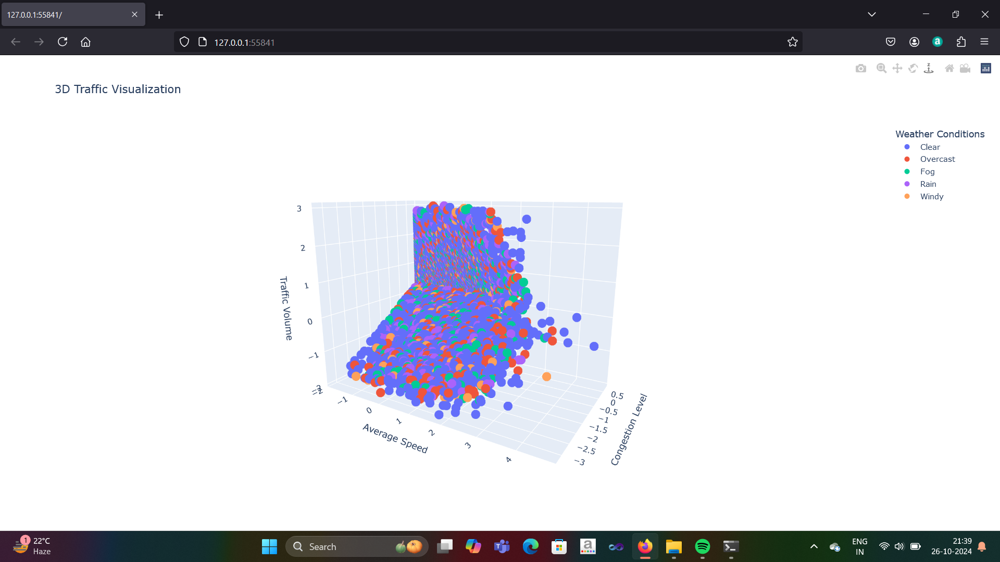
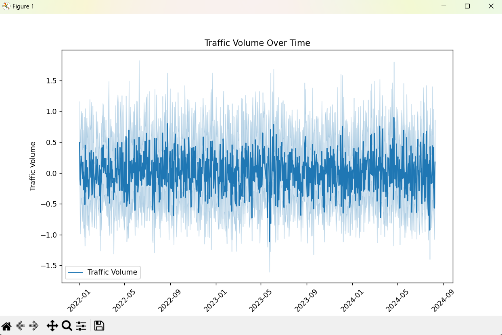
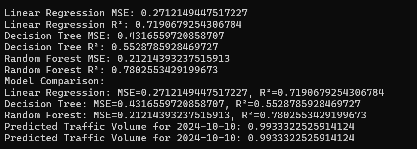

# 🚦Bangalore Traffic Analysis 
A data-driven traffic analysis project focusing on congestion patterns in Bangalore. Analyzes traffic data to identify hotspots, peak hours, and suggests possible optimization using visualizations and statistical insights.
## 📌 Project Overview

This project performs:

✅ Data cleaning & preprocessing  
✅ Exploratory Data Analysis (EDA)  
✅ Peak congestion time identification  
✅ Traffic hotspot detection  
✅ Visualizations & statistical insights  
✅ Suggestions to optimize traffic conditions  

---

## 🧠 Insights Extracted

- **Most congested time periods** in Bangalore
- **High-traffic zones / hotspots**
- **Correlation** between time, vehicle volume & congestion
- **Visual trend representation** of traffic behavior

---

## 📊 Visualizations
### Traffic Trends Over Time

*Single line graph showing temporal trend of traffic patterns throughout the day*

### Traffic Hotspots

### Variable Relationships

*Grid of scatter plots and histograms showing variable correlations and distributions*

### Peak Congestion Times

### Categorical Traffic Data

*Bar chart representing categorical data across different traffic zones*

### Time Series Fluctuations

*Line graph showing data changes over time with peak and off-peak patterns*

### Traffic Cluster Analysis

*Scatter plot with visible clusters or groupings of traffic hotspots*

### High-Frequency Traffic Patterns

*Dense line graph with many data points showing detailed traffic fluctuations*

### Project Structure

*Overview of project directory structure and files*

### Traffic Trends

---

## 🛠️ Tech Stack

| Technology | Purpose |
|------------|---------|
| Python | Core programming |
| Pandas | Data analysis |
| Matplotlib | Data visualization |
| Seaborn | Advanced visualizations |
| NumPy | Numerical computations |

---
